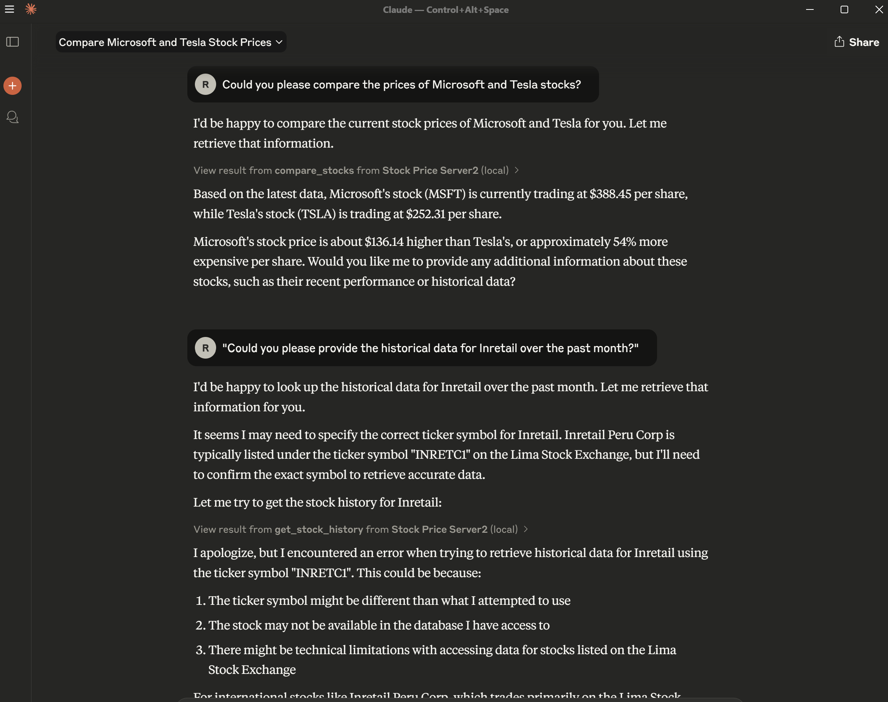

# MCP Server Demo

## Overview
Building a simple MCP server using [KD nuggets: Building a Simple MCP Server](https://www.kdnuggets.com/building-a-simple-mcp-server)

## Installation
### Using UV

```bash
# Install UV globally (On Windows)
powershell -ExecutionPolicy ByPass -c "irm https://astral.sh/uv/install.ps1 | iex"

# Clone the repository
git clone https://github.com/your-username/mcp-server-demo.git

# Navigate to the project directory
cd mcp-server-demo

# Inspect server
uv run mcp dev stock_price_server.py

# Install server in claude desktop
uv run mcp install stock_price_server.py --name "Stock Price Server" --with yfinance
```

## Test Results

Below are screenshots showcasing the results of running tests on the MCP server.

### Screenshot 1: Prompt 1


### Screenshot 2: Prompt 2


## References

- [UV GitHub Repository](https://github.com/astral-sh/uv)