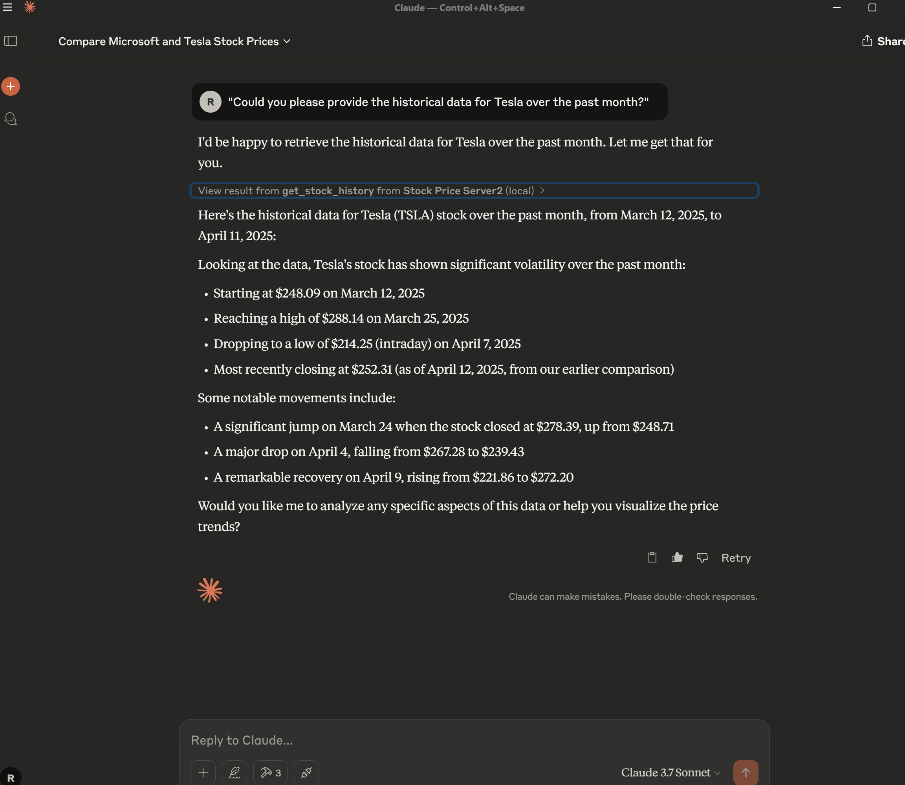

# MCP Server Demo

## Overview
Building a simple MCP server using [KD nuggets: Building a Simple MCP Server](https://www.kdnuggets.com/building-a-simple-mcp-server)

## Installation
### Using UV

```bash
# Install UV globally
npm install -g @uv/cli

# Clone the repository
git clone https://github.com/your-username/mcp-server-demo.git

# Navigate to the project directory
cd mcp-server-demo

# Start the server using UV
uv start
```

## Test Screenshots

Below are screenshots showcasing the results of running tests on the MCP server.

### Test Results

#### Screenshot 1: Prompt 1


#### Screenshot 2: Prompt 2
